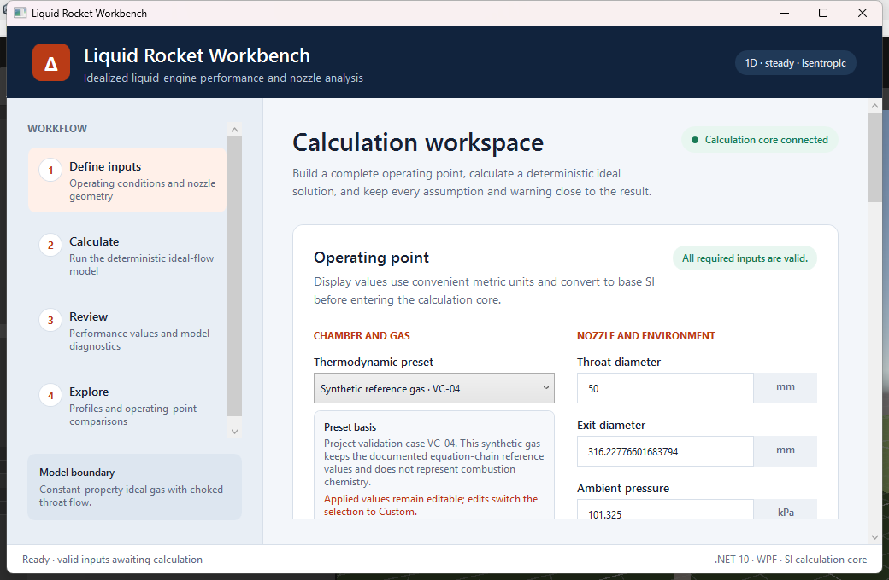
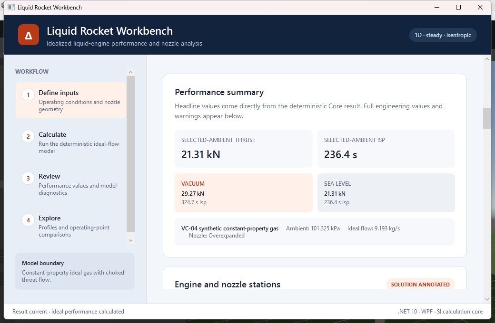
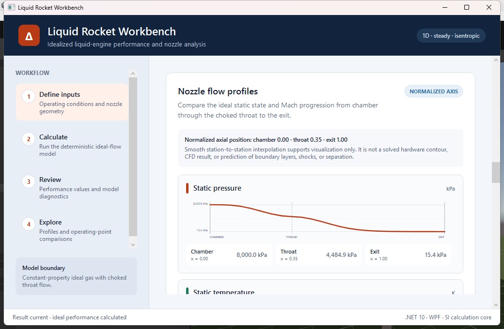
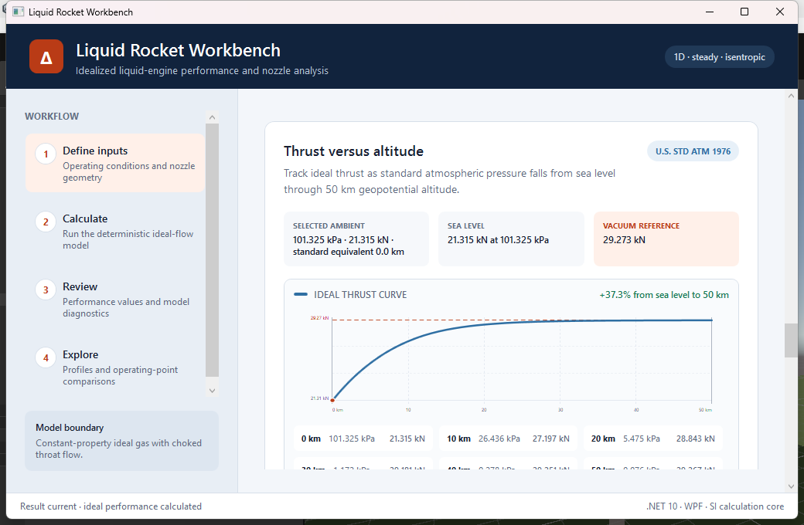

# Liquid Rocket Workbench 1.0.0

Liquid Rocket Workbench 1.0.0 is the first Windows MVP release. It provides a
desktop workflow for deterministic, first-order liquid rocket engine and nozzle
trade studies using the documented ideal model.

## Supported release

- Windows 10 or Windows 11, x64
- Self-contained .NET 10 WPF application
- Convenient metric display units with base SI calculations
- No separate .NET installation required for the published build
- No installer; extract the release ZIP and run the executable

The executable is not code-signed. Windows may show a SmartScreen warning for a
locally built or independently distributed archive. Verify the accompanying
SHA-256 file before running an archive received from another person.

## Build the release

From the repository root:

```powershell
powershell -ExecutionPolicy Bypass -File scripts/Publish-Release.ps1
```

The script restores and publishes the application, copies this guide plus the
README, engineering references, and release screenshots into the release
folder, and creates:

```text
publish/
  LiquidRocketWorkbench-1.0.0-win-x64/
    LiquidRocketWorkbench.exe
    README.md
    docs/
      release.md
      references.md
      user-guide.md
      screenshots/
        01-input-workflow.png
        02-performance-summary.png
        03-nozzle-profiles.png
        04-thrust-altitude.png
    ... self-contained .NET runtime files
  LiquidRocketWorkbench-1.0.0-win-x64.zip
  LiquidRocketWorkbench-1.0.0-win-x64.zip.sha256
```

To verify the archive:

```powershell
Get-FileHash publish\LiquidRocketWorkbench-1.0.0-win-x64.zip -Algorithm SHA256
Get-Content publish\LiquidRocketWorkbench-1.0.0-win-x64.zip.sha256
```

## Run the published build

1. Extract `LiquidRocketWorkbench-1.0.0-win-x64.zip`.
2. Open the extracted `LiquidRocketWorkbench-1.0.0-win-x64` folder.
3. Run `LiquidRocketWorkbench.exe`.
4. Choose a thermodynamic preset or edit the custom metric inputs.
5. Resolve any inline validation errors and select **Calculate performance**.
6. Review headline and detailed results, warnings, profiles, the altitude sweep,
   and optional saved operating-point comparisons.

The published folder is portable as a unit. Do not move only the executable away
from its adjacent runtime files.

For a complete walkthrough of the workflow and an explanation of every input and
result group, open [user-guide.md](user-guide.md).

## Release screenshots

### Inputs and validation



### Successful performance summary



### Normalized nozzle profiles



### Standard-atmosphere thrust exploration



## Known engineering and product limits

This application is an educational and preliminary trade-study tool. It is not
test data, a hardware design authority, or a safety-critical analysis package.

- The model is one-dimensional, steady, adiabatic, isentropic, and ideal-gas.
  Gas properties are constant, and throat flow is assumed choked.
- Chamber temperature, specific-heat ratio, gas constant, and mixture ratio come
  from editable user input or transparent presets. The application does not run
  combustion chemistry, chemical equilibrium, finite-rate chemistry, or NASA
  CEA.
- Performance uses geometry-driven ideal choked mass flow. Optional target mass
  flow is only a consistency comparison and does not override the solution.
- The model does not include combustion, divergence, boundary-layer, erosion,
  heat-transfer, real-gas, multiphase, or other efficiency losses.
- Overexpanded-flow warnings identify a conservative model-limit proxy. The
  application does not locate shocks, predict flow separation or side loads, or
  establish that attached flow is maintained.
- The engine/nozzle drawing is schematic and not to scale. It is not a hardware
  drawing or contour-sizing tool.
- Pressure, temperature, and Mach profiles use a normalized display axis with
  smooth station-to-station interpolation. They are not a solved dimensional
  contour, CFD result, or prediction of boundary layers, shocks, or separation.
- The thrust-altitude view uses the U.S. Standard Atmosphere 1976 from sea level
  through 50 km geopotential altitude while holding the solved nozzle exit state
  fixed. It is not live weather, a trajectory, or high-fidelity off-design
  performance.
- The MVP does not model transient start/stop behavior, feed systems,
  regenerative cooling, injector sizing, structural loads, materials, or test
  data.
- Display units are metric only. US customary display units are deferred.
- Saved operating-point comparisons are read-only, limited to four, and retained
  only for the current application session.
- The release targets Windows x64 only and is distributed as a portable folder,
  without an installer, automatic updater, or code signature.

Equation sources, validation cases, preset provenance, and policy assumptions are
listed in [references.md](references.md).

## Verification baseline

The release is accepted only after:

- `dotnet restore LiquidRocketWorkbench.slnx`
- a Release publish with zero warnings and errors
- the complete automated test suite passes
- the published executable launches, calculates the default operating point,
  exposes the expected result through UI Automation, and exits cleanly
- the screenshots above are captured from the published executable and visually
  inspected

From a repository checkout, the screenshots can be regenerated against the
published executable with:

```powershell
powershell -ExecutionPolicy Bypass -File scripts/Capture-ReleaseScreenshots.ps1
```
